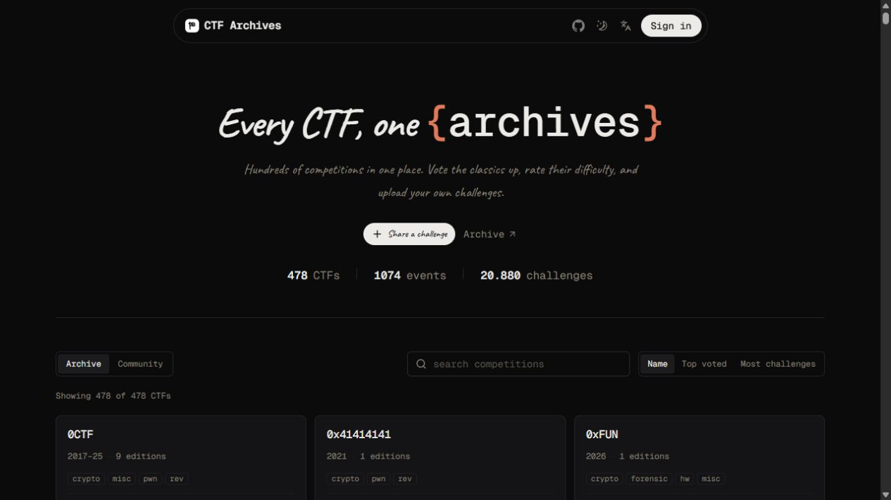

<p align="center">
  
</p>

<h1 align="center">CTF Archives</h1>

<p align="center">
  Browse hundreds of CTF competitions, thousands of events, and more than 20,000 challenges in one place.
</p>

<p align="center">
  
</p>

## Explore the archive

- Search and sort competitions by name, votes, or challenge count.
- Browse editions, categories, and challenge files from each CTF.
- Vote, rate difficulty, save challenges, and share community submissions.
- Use the archive in English, Spanish, Chinese, or Korean, with light and dark themes.

## Run locally

```bash
pnpm install
pnpm dev
```

Copy `.env.local.example` to `.env.local` and set `NEXT_PUBLIC_CONVEX_URL` before starting the app.

Challenge data comes from [sajjadium/ctf-archives](https://github.com/sajjadium/ctf-archives). Links point to the original files; nothing is rehosted.
